## 1. 架构设计

```mermaid
graph TB
    subgraph "前端层"
        A1["市民Web端"]
        A2["审批工作台Web端"]
        A3["监察预警Web端"]
        A4["数据大屏"]
        A5["自助终端界面"]
    end
    subgraph "应用服务层"
        B1["用户认证模块"]
        B2["办件申请模块"]
        B3["智能预审模块<br/>OCR+NLP"]
        B4["审批流转模块"]
        B5["并联调度模块"]
        B6["电子证照模块"]
        B7["区块链存证模块"]
        B8["消息推送模块<br/>短信+App"]
        B9["好差评模块"]
        B10["预警监察模块"]
        B11["自助终端模块"]
        B12["数据统计模块"]
    end
    subgraph "数据层"
        C1["用户数据库"]
        C2["办件数据库"]
        C3["材料文件存储"]
        C4["证照数据库"]
        C5["评价数据库"]
        C6["预警数据库"]
        C7["日志数据库"]
    end
    subgraph "外部服务"
        D1["OCR识别服务"]
        D2["NLP语义分析服务"]
        D3["短信网关服务"]
        D4["区块链节点"]
        D5["身份认证服务"]
    end
    A1 & A2 & A3 & A4 & A5 --> B1 & B2 & B3 & B4 & B5 & B6 & B7 & B8 & B9 & B10 & B11 & B12
    B1 & B2 & B3 & B4 & B5 & B6 & B7 & B8 & B9 & B10 & B11 & B12 --> C1 & C2 & C3 & C4 & C5 & C6 & C7
    B3 --> D1 & D2
    B8 --> D3
    B7 --> D4
    B1 --> D5
```



## 2. 技术说明
- 前端：React@18 + TypeScript + Vite + TailwindCSS@3 + React Router
- 图表：Recharts（折线/柱状/饼图）+ 自定义大屏可视化组件
- 状态管理：React Context + useReducer
- 图标：Lucide React
- 动效：Framer Motion（页面过渡+微交互）
- 后端：前端Mock数据（无需真实后端，使用本地JSON模拟）
- 存储：LocalStorage（持久化用户会话和数据）

## 3. 路由定义
| 路由 | 用途 |
|-----|------|
| /login | 统一登录页（角色切换） |
| /citizen | 市民首页仪表盘 |
| /citizen/apply | 事项申请+智能预审 |
| /citizen/applications | 我的办件列表 |
| /citizen/applications/:id | 办件详情+进度 |
| /citizen/review/:id | 办件好差评 |
| /citizen/certificates | 电子证照中心 |
| /workbench | 审批工作台首页 |
| /workbench/cases | 待办/已办列表 |
| /workbench/cases/:id | 办件审批详情 |
| /workbench/parallel | 并联审批中心 |
| /supervisor | 监察首页 |
| /supervisor/warnings | 红黄牌预警中心 |
| /supervisor/monitor | 办件全程监控 |
| /supervisor/performance | 绩效统计 |
| /dashboard | 数据大屏展示 |
| /kiosk | 自助终端界面 |
| /kiosk/print | 证明打印页面 |

## 4. 数据模型定义

### 4.1 核心数据类型

```typescript
// 用户
interface User {
  id: string;
  username: string;
  name: string;
  role: 'citizen' | 'clerk' | 'manager' | 'supervisor';
  phone: string;
  idCard?: string;
  department?: string;
  avatar?: string;
}

// 办事事项
interface ServiceItem {
  id: string;
  name: string;
  category: string;
  department: string;
  requiredMaterials: string[];
  isParallel: boolean;
  processingDays: number;
  description: string;
}

// 办件申请
interface Application {
  id: string;
  caseNo: string;
  serviceItemId: string;
  serviceItemName: string;
  applicantId: string;
  applicantName: string;
  applicantPhone: string;
  materials: MaterialItem[];
  status: 'draft' | 'submitted' | 'prechecking' | 'pending' | 'reviewing' | 'approved' | 'rejected' | 'completed';
  precheckResult?: PrecheckResult;
  assignees: Assignee[];
  currentStep: number;
  flowNodes: FlowNode[];
  createdAt: string;
  deadline: string;
  warningLevel?: 'none' | 'yellow' | 'red';
  parallelGroups?: ParallelGroup[];
}

// 材料项
interface MaterialItem {
  id: string;
  name: string;
  fileName: string;
  ocrResult?: string;
  nlpResult?: NlpAnalysis;
  isComplete: boolean;
  missingTips?: string;
}

// NLP分析结果
interface NlpAnalysis {
  isSemanticComplete: boolean;
  missingInfo: string[];
  confidence: number;
}

// 智能预审结果
interface PrecheckResult {
  isComplete: boolean;
  missingMaterials: string[];
  missingInfo: string[];
  suggestions: string[];
}

// 审批流转节点
interface FlowNode {
  id: string;
  name: string;
  type: 'serial' | 'parallel';
  assignee?: string;
  assigneeName?: string;
  status: 'pending' | 'processing' | 'completed' | 'skipped';
  startedAt?: string;
  completedAt?: string;
  comment?: string;
  parallelGroupId?: string;
}

// 并联审批组
interface ParallelGroup {
  id: string;
  name: string;
  nodeIds: string[];
}

// 电子证照
interface Certificate {
  id: string;
  certificateNo: string;
  type: string;
  holderName: string;
  applicationId: string;
  issuedAt: string;
  validUntil: string;
  issuer: string;
  blockchainTx?: string;
  blockchainHash?: string;
  isVerified: boolean;
  status: 'valid' | 'expired' | 'revoked';
}

// 区块链存证记录
interface BlockchainRecord {
  id: string;
  hash: string;
  previousHash: string;
  dataType: 'certificate' | 'application' | 'operation';
  dataRef: string;
  timestamp: string;
  nodeSignature: string;
}

// 好差评
interface Review {
  id: string;
  applicationId: string;
  rating: 1 | 2 | 3 | 4 | 5;
  tags: string[];
  comment: string;
  createdAt: string;
  isBadReview: boolean;
  ticketId?: string;
}

// 差评整改工单
interface RectificationTicket {
  id: string;
  reviewId: string;
  applicationId: string;
  status: 'pending' | 'processing' | 'verified' | 'closed';
  assignee: string;
  assigneeName: string;
  measures: string;
  callbackRecord?: string;
  createdAt: string;
  closedAt?: string;
}

// 预警记录
interface Warning {
  id: string;
  applicationId: string;
  caseNo: string;
  level: 'yellow' | 'red';
  triggeredAt: string;
  deadline: string;
  overDays: number;
  assignee: string;
  assigneeName: string;
  department: string;
  status: 'pending' | 'handled' | 'closed';
  handler?: string;
  handleComment?: string;
  handledAt?: string;
}

// 消息通知
interface Notification {
  id: string;
  userId: string;
  type: 'sms' | 'inapp' | 'push';
  title: string;
  content: string;
  relatedId?: string;
  isRead: boolean;
  sentAt: string;
}

// 自助终端打印日志
interface PrintLog {
  id: string;
  kioskId: string;
  idCardNo: string;
  certificateType: string;
  certificateNo: string;
  printedAt: string;
  copies: number;
  status: 'success' | 'failed';
  failureReason?: string;
}

// 部门数据
interface Department {
  id: string;
  name: string;
  code: string;
}

// 大屏统计数据
interface DashboardStats {
  todayCount: number;
  totalCount: number;
  avgProcessingDays: number;
  satisfactionRate: number;
  pendingCount: number;
  warningCount: number;
  hotServices: { name: string; count: number }[];
  byDepartment: { dept: string; count: number; avgDays: number; rate: number }[];
  trendData: { date: string; count: number }[];
}
```

### 4.2 初始Mock数据
- 预置4个测试用户（每种角色各1个）
- 预置10+常见办事事项
- 预置20+模拟办件数据（覆盖不同状态）
- 预置电子证照、评价、预警等模拟数据
