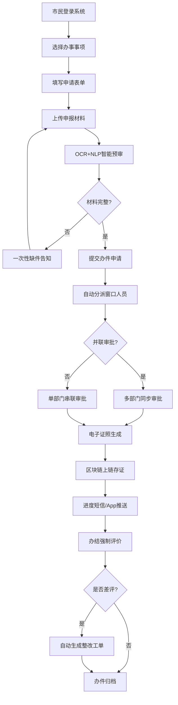

## 1. 产品概述
市民服务中心"一网通办"审批系统，为市民提供一站式在线政务服务，实现材料智能预审、并联审批、电子证照上链存证、红黄牌预警监察、好差评闭环管理、自助终端服务及数据可视化等核心功能。
- 目标用户：市民群众、窗口人员、科室负责人、监察人员
- 核心价值：提升政务服务效率，优化营商环境，实现审批全流程透明化、智能化、可追溯

## 2. 核心功能

### 2.1 用户角色
| 角色 | 注册方式 | 核心权限 |
|------|---------|---------|
| 市民 | 实名认证注册 | 提交办件、上传材料、查看进度、评价、打印证明 |
| 窗口人员 | 后台分配账号 | 受理办件、审核材料、补充信息、核发证照 |
| 科室负责人 | 后台分配账号 | 审批分派、并联审批协调、审核签发、差评整改跟踪 |
| 监察员 | 后台分配账号 | 红黄牌预警处置、办件全程监控、绩效考核、数据统计分析 |

### 2.2 功能模块
1. **登录/首页**：角色选择登录、待办统计、快捷入口、公告通知
2. **市民办事大厅**：事项检索、办件申请、材料上传、智能预审、进度查询
3. **审批工作台**：办件受理、材料审核、并联审批、证照签发
4. **电子证照中心**：证照展示、证照详情、区块链存证验证、证照下载
5. **好差评系统**：办件评价、差评工单、整改回访、评价统计
6. **监察预警中心**：红黄牌预警、超时督办、全程监控、绩效统计
7. **自助终端**：身份证读取、证明打印、打印日志记录
8. **数据大屏**：办件量统计、办结时长分析、好评率、热门事项、部门筛选

### 2.3 页面详情
| 页面名称 | 模块名称 | 功能描述 |
|---------|---------|---------|
| 登录页 | 角色选择 | 四级用户角色切换、账号密码登录、验证码 |
| 市民首页 | 办件概览 | 我的办件列表、待办提醒、常用事项快捷入口 |
| 事项申请页 | 智能预审 | OCR识别材料、NLP语义分析、缺件一次性告知、材料完整性校验 |
| 审批工作台 | 办件流转 | 自动分派、并联审批同步、材料审核、审批意见填写 |
| 电子证照中心 | 证照存证 | 证照生成、区块链上链、哈希验证、证照下载打印 |
| 好差评页 | 评价管理 | 星级评价、文字评价、差评自动生成工单、回访记录 |
| 监察预警中心 | 预警管理 | 超时检测、红黄牌自动触发、督办通知、处置记录 |
| 数据大屏 | 可视化 | 实时办件量、平均办结时长、好评率、热门事项排行、部门筛选器 |
| 自助终端 | 证明打印 | 身份证读卡、证明类型选择、打印、日志记录 |

## 3. 核心流程

### 3.1 市民办件流程
市民登录→选择办事事项→填写表单→上传材料→OCR+NLP智能预审→缺件一次性告知补正→材料完整提交→系统自动分派窗口→并联审批同步进行→电子证照生成上链→进度实时推送→办结强制评价→差评自动生成整改工单

### 3.2 监察预警流程
系统定时检测→超时未办结→触发黄牌预警（超时50%）→触发红牌预警（超时100%）→推送监察部门→督办处置→绩效记录

## 4. 用户界面设计

### 4.1 设计风格
- 主色调：政务蓝 (#1E5AA8)，辅助色：预警红 (#E53935)、警告橙 (#FB8C00)、成功绿 (#43A047)、信任紫 (#8E24AA)
- 按钮风格：圆角8px，渐变背景，悬浮阴影动效
- 字体：思源黑体（Source Han Sans）标题 + 思源宋体正文
- 布局风格：顶部导航 + 侧边菜单 + 卡片式内容区，专业政务风格
- 图标：统一线性图标风格，配合政务场景使用

### 4.2 页面设计概述
| 页面名称 | 模块名称 | UI元素 |
|---------|---------|--------|
| 登录页 | 品牌区+表单区 | 政务蓝渐变背景、毛玻璃登录卡片、角色切换标签、动态粒子背景 |
| 市民首页 | 仪表盘 | 数据卡片、进度环形图、办件列表、快捷入口图标网格 |
| 智能预审页 | 预审流程 | 步骤引导条、材料上传拖拽区、OCR识别进度、缺件高亮提示 |
| 审批工作台 | 办件列表 | 表格布局、状态标签、优先级标识、并联审批时间轴 |
| 电子证照中心 | 证照展示 | 证照仿真卡片、区块链存证标识、哈希值展示、验证徽章 |
| 好差评页 | 评价表单 | 星级评分组件、表情图标、评价标签、快速评价按钮 |
| 监察预警中心 | 预警看板 | 红黄牌警示卡片、预警列表、督办按钮、处置弹窗 |
| 数据大屏 | 可视化看板 | 深色科技蓝背景、动态数字滚动、环形图/柱状图/折线图、地图热力图、筛选器 |
| 自助终端 | 打印界面 | 大字体高对比度、身份证读卡区动效、打印进度动画 |

### 4.3 响应式
- 桌面端优先设计（1920px），适配平板端
- 市民端适配移动端，审批及监察端主要面向桌面
- 自助终端采用全屏触控适配（1080P触摸屏）
- 触控按钮最小尺寸48px×48px

### 4.4 动效与交互
- 页面加载：元素渐入+位移，错开时间轴
- 数据卡片：悬浮微抬升+阴影加深
- 预警提示：脉冲呼吸动画
- 流程步骤：连线渐变动画
- 数字统计：滚动递增动画
